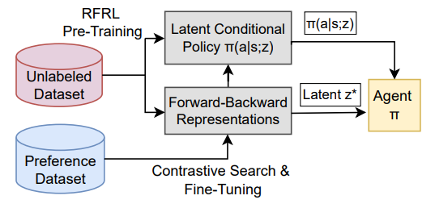

# FB-PbRL

<p align="center">
  
</p>

**From Reward-Free Representations to Preferences: Rethinking Offline Preference-Based Reinforcement Learning**

Jun-Jie Yang, Chia-Heng Hsu, Kui-Yuan Chen, Ping-Chun Hsieh

*International Conference on Machine Learning (ICML), 2026*

## Overview

**FB-PbRL** is a reward-free representation learning framework for offline preference-based reinforcement learning. The method first learns latent successor-measure representations from reward-free offline data using Forward-Backward (FB) representation learning, and then adapts these representations through contrastive search and preference-guided fine-tuning.

## Code Structure
```
FB-PbRL/
    ├── FB_contrastive/metamotivo/
    │   ├── fb_train_dmc.py                              --- pretrain FB on DMC offline datasets
    │   ├── fb_train_metaworld.py                        --- pretrain FB on MetaWorld
    │   ├── fb_train_d4rl_adroit.py                      --- pretrain FB on D4RL Adroit
    │   ├── fb_finetune_dmc_contrastive_hilp_dmc.py      --- offline PbRL fine-tuning (DMC)
    │   ├── fb_finetune_dmc_contrastive_hilp_dmc_zero_shot.py  --- zero-shot PbRL fine-tuning (DMC)
    │   ├── fb_finetune_metaword_contrastive.py          --- PbRL fine-tuning (MetaWorld)
    │   ├── new_collect.py                               --- collect offline preference datasets
    │   ├── new_collect_zeroshot.py                      --- collect zero-shot preference datasets
    │   ├── utils.py                                     --- utility functions
    │   ├── requirements.txt                             --- required packages
    │   └── metamotivo/
    │       ├── fb/                                      --- base FB implementation
    │       ├── fb_dmc/                                  --- FB pretrain agent (DMC)
    │       ├── fb_contrastive_finetune/                 --- contrastive preference fine-tuning agent (DMC)
    │       ├── fb_contrastive_finetune_metaworld/       --- MetaWorld fine-tuning agent
    │       ├── fb_adroit_flowbc/                        --- Adroit FlowBC variant
    │       ├── fb_contrastive_finetune_adroit_flowbc/   --- Adroit contrastive fine-tuning agent
    │       ├── buffers/                                 --- replay buffer implementations
    │       ├── nn_models.py                             --- shared network architectures (BackwardMap, ForwardMap, Actor)
    │       └── wrappers/                                --- environment wrappers
    └── Baseline/
        ├── CLARIFY_OPRL/                                --- reproduce CLARIFY / OPRL baselines
        └── BT_model/                                    --- Bradley-Terry reward model baseline
```

## Requirements

This repository relies on the `metamotivo` environment and dependency setup.

To install the required packages, first enter the `metamotivo` directory and install the dependencies:

```bash
cd FB_contrastive/metamotivo
pip install -r requirements.txt
```

The core dependencies are:

- Python 3.9
- PyTorch 2.0
- `dm_control` 1.0
- MuJoCo 3.3
- Gym 0.23
- Weights & Biases (`wandb`)

For a complete description of the environment setup, package requirements, and additional configuration details, please refer to the [`metamotivo` README](FB_contrastive/metamotivo/README.md).

## Codebase

This repository is based on the codebase of **Zero-Shot Whole-Body Humanoid Control via Behavioral Foundation Models**.

The original source code is copyright © Meta Platforms, Inc. and affiliates, and is licensed under the **Creative Commons Attribution-NonCommercial 4.0 International (CC BY-NC 4.0)** license.

We modified and extended the original implementation for our problem setting and experiments, including data processing, the finetuning pipeline, and evaluation.

## Citation

If you find this repository useful, please consider citing our work:


